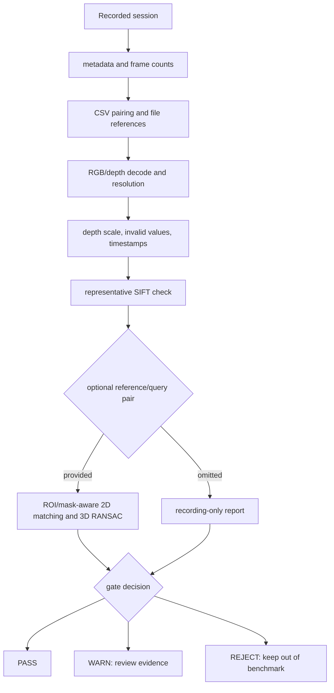

# Confidence-Aware RGB-D Correspondence for Unseen Object Pose Estimation

Small, independent research code for matching an unseen object between two
RGB-D observations, lifting correspondences into 3-D, and estimating a
relative rigid transform. The project is inspired by the confidence-aware
correspondence idea in COG, but is **not an exact reproduction of COG**.

The implementation is intentionally modest: OpenCV SIFT/ORB, explicit depth
validity, heuristic appearance confidence, weighted Kabsch refinement, and
confidence-biased RANSAC. The goal is a reproducible CPU-capable baseline that
can be inspected before larger models or experiments are introduced.

## Pipeline

```mermaid
flowchart LR
    A[Windows D435i capture] --> B[Aligned RGB-D sequence]
    B --> C[Read-only sequence adapter]
    C --> D[RGB + depth + intrinsics]
    D --> E[SIFT/ORB features]
    E --> F[Mutual-NN matches]
    F --> G[Appearance confidence]
    D --> H[2D-to-3D back-projection]
    G --> I[Confidence-aware 3D correspondences]
    H --> I
    I --> J[Weighted Kabsch + RANSAC]
    J --> K[SE(3), inliers, RMSE]
```

The current confidence score is a transparent heuristic, not a calibrated
probability. No learned optimal-transport model is claimed or included.

## Recording-quality gate

Every recorded sequence can be screened before it enters an experiment. The
gate never writes to the original session and returns a machine-readable
`PASS`, `WARN`, or `REJECT` report.



## Verified status

| Component | Status | Evidence level |
|---|---|---|
| Custom `rgb.png` / `depth_m.npy` / `intrinsics.txt` loader | Implemented | Existing unit tests |
| D435i sequence adapter using `frames.csv` | Implemented | Unit tests and read-only real-session decoding |
| RGB channel and raw `uint16` depth handling | Implemented | Synthetic-session tests; `0` and `65535` invalid |
| Camera intrinsics and 2D-to-3D back-projection | Implemented | Unit tests and real-session pair diagnostics |
| SIFT baseline and mutual-NN matching | Implemented | CPU execution on real frames |
| Confidence-aware weighted Kabsch/RANSAC | Implemented | Deterministic synthetic validation |
| Read-only recording-quality validator | Implemented | Unit tests and full real-session scan |
| Rectangular reference/query feature ROI | Implemented | Unit tests and real SIFT sanity check |
| Polygonal reference/query feature mask | Implemented | Unit tests and real-session SIFT run |
| Read-only motion/stable-segment scan | Implemented | Deterministic tests and real-session scan |
| Candidate RGB/depth review package | Implemented | Real-session contact sheets and manifest |
| Explicit reviewed-pair approval gate | Implemented | Unit tests and pending/approved CLI checks |
| DINOv2 backend | Code path only | Not installed or experimentally validated |
| Ground-truth pose benchmark | Not available | Manual rotation is not ground truth |
| Weighted-vs-unweighted experimental comparison | Not implemented | Deliberately out of scope for the current stage |

The verified synthetic run reports:

```text
inliers=105/160
weighted_rmse_m=0.003205
rotation_error_deg=0.0839
translation_error_m=0.001614
```

These are synthetic results with known generated motion and outliers. They are
not real-world measurements.

## Environment

The development target is:

- WSL2 Ubuntu 22.04 for CPU development and later GPU inference;
- Python 3.10 in a project-local `.venv`;
- Windows-side D435i capture with aligned color/depth;
- offline sequence inspection from a mounted path such as `/mnt/e/...`.

The CPU sequence adapter and SIFT baseline do not require direct D435i USB
access from WSL. `pyrealsense2` is only needed by the acquisition script on a
machine with the camera. PyTorch, Open3D, ROS, CUDA toolkits, and DINOv2 are
not required for the current baseline.

## Installation

```bash
source .venv/bin/activate
pip install -e '.[vision,dev]'
```

Run the checks:

```bash
python -m pytest -q
python scripts/synthetic_demo.py
python -m pip check
```

## Data formats

The original small pair pipeline remains compatible with frame directories:

```text
frame_directory/
├── rgb.png
├── depth_m.npy
└── intrinsics.txt
```

The D435i recorder uses a read-only session directory:

```text
session/
├── calibration.json
├── color/*.png
├── depth/*.png
├── frames.csv
├── imu.csv
├── metadata.json
└── validation_report.json
```

`frames.csv` is the authoritative RGB/depth pairing table. The adapter parses
aligned color-camera intrinsics from `calibration.json`, converts raw `uint16`
depth using the recorded scale, and maps raw `0` and `65535` to invalid metric
depth `0.0`. It does not impose a hidden 3 m cutoff.

Raw captures and mounted Windows paths are intentionally not part of this
repository.

## Usage

### Inspect one recorded frame

```bash
python scripts/inspect_realsense_sequence.py \
  /mnt/e/path/to/session \
  --frame-index 30 \
  --output results/frame_030
```

The command writes an RGB preview, a normalized depth preview, and a JSON
summary without modifying the session.

### Screen a recording

Recording-only scan:

```bash
python scripts/validate_experiment_candidate.py \
  /mnt/e/path/to/session \
  --full-scan \
  --output results/session_quality.json
```

To help select static reference/query frames after recording, add the motion
scan. It implies a full RGB-D decode and reports candidate change intervals and
stable frame segments. A broad target ROI makes small object/hand motion more
visible than a whole-image score:

```bash
python scripts/validate_experiment_candidate.py \
  /mnt/e/path/to/session \
  --motion-scan \
  --motion-roi 160 80 480 400 \
  --output results/session_motion_quality.json
```

The motion score is a low-resolution RGB difference heuristic. It identifies
candidate changes but does not determine whether the cause was a hand, object,
lighting, or camera motion. It is a frame-selection aid, not pose ground truth.
Reported stable segments mean only low temporal RGB change; a hand that remains
still can still be present, so candidate segments require visual review. When
triggers are found, the JSON report sets `manual_review_required: true`.

Export a small visual review package without rescanning the session:

```bash
python scripts/export_motion_review.py \
  /mnt/e/path/to/session \
  --quality-report results/session_motion_quality.json \
  --output results/session_motion_review
```

The output contains RGB/depth contact sheets, individual candidate-frame
previews, and `review_manifest.json` with `PENDING_MANUAL_REVIEW` status.

After visually confirming a pair, approve it explicitly:

```bash
python scripts/approve_motion_review.py \
  results/session_motion_review/review_manifest.json \
  --reference-index 80 \
  --query-index 500 \
  --note "visually checked; no hand visible in either selected frame"
```

Pass the approved manifest to the pair runner or quality gate to enforce the
decision. Omitting `--review-manifest` preserves the existing backward-
compatible behavior.

```bash
python scripts/run_pair.py \
  --session /mnt/e/path/to/session \
  --reference-index 80 \
  --query-index 500 \
  --backend sift \
  --review-manifest results/session_motion_review/review_manifest.json \
  --output results/approved_pair.json
```

Add a pair-level SIFT/3-D check when the intended reference and query frames
are known:

```bash
python scripts/validate_experiment_candidate.py \
  /mnt/e/path/to/session \
  --reference-index 60 \
  --query-index 260 \
  --backend sift \
  --reference-roi 180 155 410 470 \
  --query-roi 180 155 440 470 \
  --output results/pair_quality.json
```

The exit codes are `0=PASS`, `1=WARN`, and `2=REJECT`. A recording-level
decision and a pair-level decision are reported separately. A pair can pass
while the recording remains rejected because of an unrelated warm-up frame or
recording-quality issue.

### Estimate a pair

The existing positional frame-directory interface is preserved:

```bash
python scripts/run_pair.py \
  data/object/view_000 data/object/view_001 \
  --backend sift \
  --output results/pair.json
```

The D435i sequence mode uses two indices from one session:

```bash
python scripts/run_pair.py \
  --session /mnt/e/path/to/session \
  --reference-index 60 \
  --query-index 260 \
  --backend sift \
  --reference-roi 180 155 410 470 \
  --query-roi 180 155 440 470 \
  --output results/pair.json \
  --evidence-dir results/pair_evidence
```

ROI coordinates use `(x0, y0, x1, y1)` with exclusive upper bounds. They mask
feature extraction while retaining full-image keypoint coordinates; they do
not crop or alter the RGB-D data. Separate reference and query rectangles are
supported because viewpoint changes move the object.

For a tighter manual object mask, pass polygon vertices as a flat sequence of
`x y` values. The reference and query polygons may differ because the visible
object silhouette can change:

```bash
python scripts/run_pair.py \
  --session /mnt/e/path/to/session \
  --reference-index 80 \
  --query-index 500 \
  --backend sift \
  --reference-polygon 258 129 369 119 391 298 273 327 258 303 \
  --query-polygon 300 117 408 150 415 323 331 341 210 249 254 166 \
  --output results/pair_polygon.json
```

The polygon intersects a supplied rectangle when both are present. It masks
feature extraction only; the original RGB-D files remain untouched.

## Real-data interpretation

The inspected `anime_box_small_turn` recording contains an initial static
front-facing box, a hand-driven rotation interval, and a final static rotated
box. A clean diagnostic pair was selected from frames `60` and `260`:

| Metric | Reference 60 | Query 260 |
|---|---:|---:|
| RGB-depth timestamp difference | 9.199 ms | 9.063 ms |
| Full-frame usable depth ratio | 94.25% | 94.56% |
| ROI SIFT features | 357 | 375 |
| Visual matches | — | 77 |
| Valid 3D matches | — | 74 |
| RANSAC inliers | — | 65 |
| Inlier ratio | — | 0.8784 |
| Weighted RMSE | — | 0.002723 m |

This is a static-camera diagnostic with manually observed object motion. The
manual rotation is not an independently measured pose, so the transform is
not reported as a pose error or ground-truth evaluation. The fixed curtain and
table can still produce raw SIFT matches, so a manually specified polygon mask
is useful for diagnostics, but it is not automatic segmentation or benchmark
ground truth.

## Limitations and scope

- The confidence score is heuristic and not calibrated.
- Rectangular ROIs and polygon masks are manual; automatic segmentation is not
  implemented.
- No ground-truth object pose is currently recorded.
- Static-camera sequences are useful for parsing and sanity checks, not for a
  viewpoint-change benchmark by themselves.
- Low-texture surfaces, occlusion, object symmetries, and missing depth can
  still produce plausible but incorrect correspondences.
- DINOv2, Open3D, ROS, Gazebo, Isaac Sim, and a large benchmark are deliberately
  deferred.

The intended next research step is a controlled viewpoint-change capture with
known camera/object motion or an independent fiducial/robotic reference, while
keeping the screening gate ahead of all experiment ingestion.
